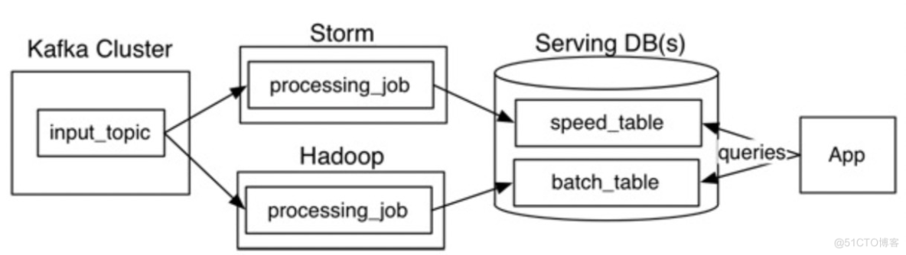
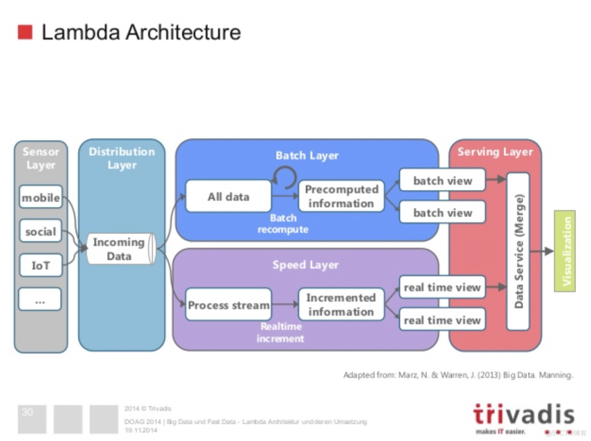

## 参考设计

> <https://blog.51cto.com/u_13746986/3006710>

## 优化设计

待补充

## 优缺点

优点：

1. 很好的结合来离线批处理和实时流处理的优点
2. 稳定且实时计算成本可控
3. 离线数据易于修正
4. 架构灵活性

缺点：

1. 大量在不同存储系统和数据格式中数据迁移和转换，造成维护困难和额外成本
2. 数据运维困难: 有两套系统架构（批处理层和速度层）
3. Batch Layer和Speed Layer需要维护两套代码，同时要确保实现逻辑一致性
4. 异常错误的的捕获、处理和修正复杂
5. 前端查询的复杂度非常大，往往需要通过联邦计算来合并数据集，实效性受到数据集合合并的效率限制
