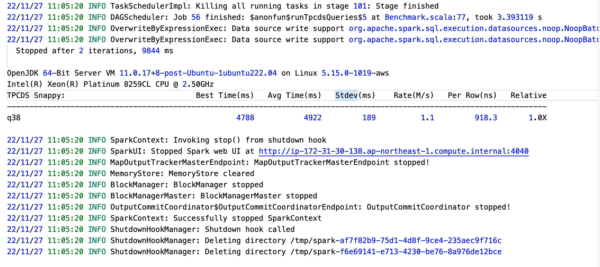

## 1. 运行脚本

```bash
./spark-3.1.1-bin-hadoop2.7/bin/spark-submit --conf spark.sql.planChangeLog.level=WARN --class org.apache.spark.sql.execution.benchmark.TPCDSQueryBenchmark --jars spark-core_2.12-3.1.1-tests.jar,spark-catalyst_2.12-3.1.1-tests.jar spark-sql_2.12-3.1.1-tests.jar --data-location tpcds-data-1g --query-filter "q38"  1>run.log 2>&1
```

### SQL语句

```SQL
SELECT count(*)
FROM (
       SELECT DISTINCT
         c_last_name,
         c_first_name,
         d_date
       FROM store_sales, date_dim, customer
       WHERE store_sales.ss_sold_date_sk = date_dim.d_date_sk
         AND store_sales.ss_customer_sk = customer.c_customer_sk
         AND d_month_seq BETWEEN 1200 AND 1200 + 11
       INTERSECT
       SELECT DISTINCT
         c_last_name,
         c_first_name,
         d_date
       FROM catalog_sales, date_dim, customer
       WHERE catalog_sales.cs_sold_date_sk = date_dim.d_date_sk
         AND catalog_sales.cs_bill_customer_sk = customer.c_customer_sk
         AND d_month_seq BETWEEN 1200 AND 1200 + 11
       INTERSECT
       SELECT DISTINCT
         c_last_name,
         c_first_name,
         d_date
       FROM web_sales, date_dim, customer
       WHERE web_sales.ws_sold_date_sk = date_dim.d_date_sk
         AND web_sales.ws_bill_customer_sk = customer.c_customer_sk
         AND d_month_seq BETWEEN 1200 AND 1200 + 11
     ) hot_cust
LIMIT 100
```

### 1.2 运行截图



## 2. 优化规则

```
org.apache.spark.sql.catalyst.optimizer.CollapseProject
org.apache.spark.sql.catalyst.optimizer.ColumnPruning
org.apache.spark.sql.catalyst.optimizer.ConstantFolding
org.apache.spark.sql.catalyst.optimizer.EliminateLimits
org.apache.spark.sql.catalyst.optimizer.InferFiltersFromConstraints
org.apache.spark.sql.catalyst.optimizer.PushDownLeftSemiAntiJoin
org.apache.spark.sql.catalyst.optimizer.PushDownPredicates
org.apache.spark.sql.catalyst.optimizer.RemoveNoopOperators
org.apache.spark.sql.catalyst.optimizer.ReorderJoin
org.apache.spark.sql.catalyst.optimizer.ReplaceDistinctWithAggregate
org.apache.spark.sql.catalyst.optimizer.ReplaceIntersectWithSemiJoin
org.apache.spark.sql.catalyst.optimizer.RewritePredicateSubquery
```

### 2.1 CollapseProject

合并两个确定且独立的列。
两个select操作会被合并成一个，并且和数据来源的逻辑计划进行合并，两个前后依赖的select列的运算也被合并在一起。

### 2.2 PushDownPredicates

谓词下推规则。
将SQL中的过滤条件尽可能的下推至底层，以尽可能的将过滤靠近数据源，以提升整体执行效率。
